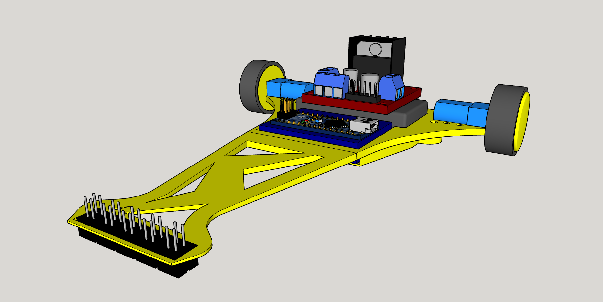

# KizaruBot

El primer robot siguelineas creado por OPRobots; "fácilmente" replicable

## Hardware
- Arduino Nano
- Protoboard
- Driver de motores L298N
- 2x Motores "Pololu" N20 @2000rpm
- LiPo 2S ~250 mAh
- 5x Sensores CNY70
- 5x Resistencias 47kΩ
- 5x Resistencias 220Ω
- Goma de ruedas reciclada de rodillos de impresora
- Chasis completamente impreso en PLA

## Software
- Programado con Arduino IDE
- Programa muy básico con condiciones de línea y asignación de velocidad súper simples
